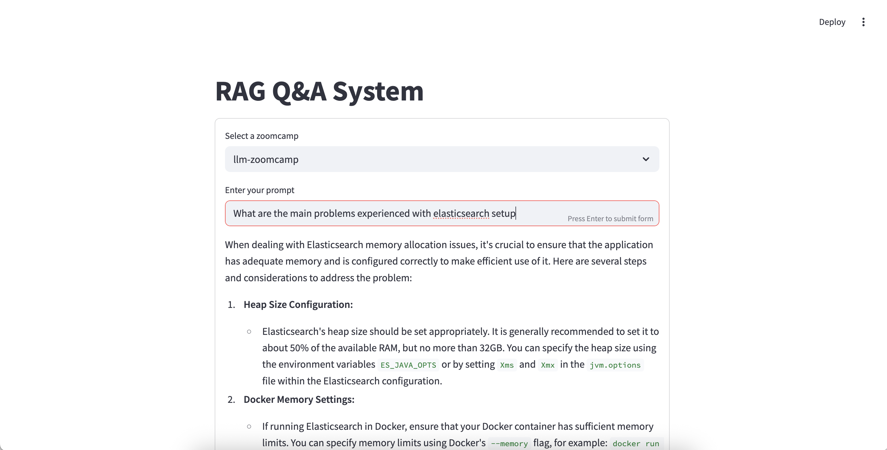

# llm-zoomcamp

##  Getting started

Install all workspace and dev dependencies into ./.venv and register IPython kernel for llm-rag-workshop. These are one-off commands

```bash
make sync
make kernel
```

To run Jupyter Lab and launch Docker services (Ollama & Elasticsearch) in the background

```bash
make services
```

Note to setup Elastic search and index the documents into 'course-questions' you will need to run the [elastic-search notebook](packages/llm-rag-zoomcamp/notebooks/elastic-search.ipynb).

Finally the RAG Streamlit application

```bash
make streamlit
```



## Troubleshooting

If you need to troubleshoot then viewing the elastic search logs will be very helpful

```bash
docker compose logs -f elasticsearch
```
