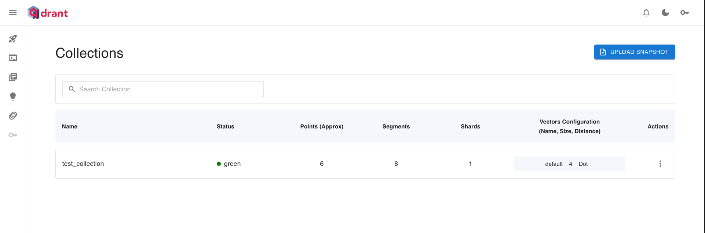
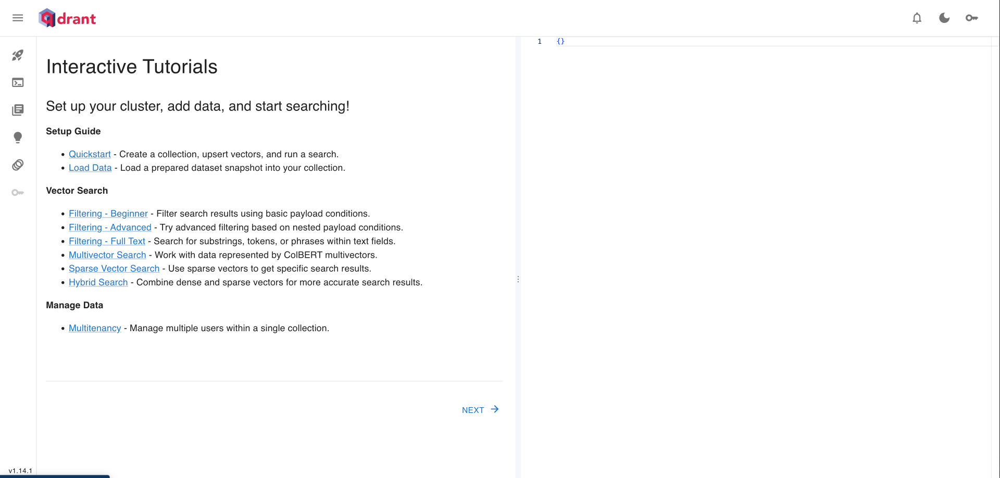

# Vector Search

## Getting started

From root run

```bash
make compose-up-vector
```

Then in browser goto the [Dashboard](http://localhost:6333/dashboard#/collections)




From root folder - run

```bash
make run-vector-search
```

which will return the rag response

```text
python -m vector_search.app
Answer:
Qdrant works with large language models (LLMs) by storing vectorized representations of data. These vectors can then be retrieved based on user queries. This retrieved context is passed to the LLM for generation in a process called retrieval-augmented generation (RAG). It's also possible to integrate Qdrant with LLMs through third-party applications like LangChain, which uses Qdrant as a retriever for documents in a RetrievalQA chain. This allows for semantic search and injecting context into LLM prompts.

Sources:
- To integrate Qdrant with large language models (LLMs), you store vectorized representations of your data in Qdrant and retrieve the most relevant vectors based on user queries. This retrieved context can then be passed to an LLM for generation — this is known as retrieval-augmented generation (RAG).
- LangChain offers built-in integration with Qdrant, allowing you to use Qdrant as a retriever for documents in a RetrievalQA chain. This enables seamless semantic search and context injection into LLM prompts.
- Qdrant is a high-performance vector database that stores embeddings and allows fast similarity searches. It's ideal for AI and ML applications, including recommendation systems and semantic search.
```

## Semantic Search

We are using the following embedding [jinaai model](https://huggingface.co/jinaai/jina-embeddings-v2-small-en).
